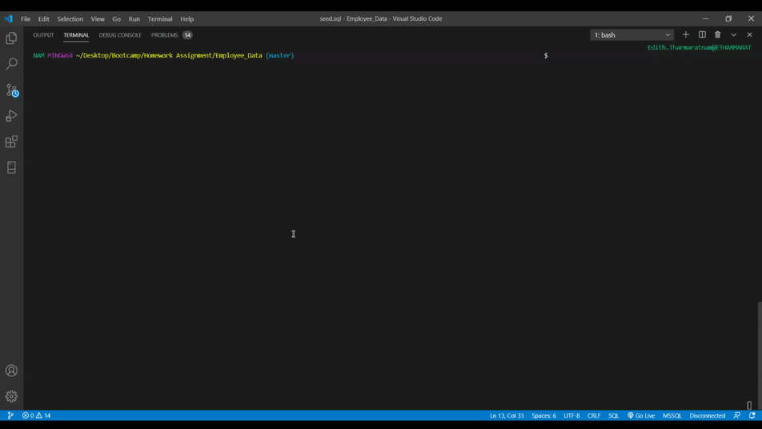

  
# Content Management on CLI with SQL and Node

## Description
Interacting with information stored in the database using CLI with Node, inquirerand MySQL.

## Table Of Contents
* [Installation](#Installation)
* [Usage](#Usage)
* [Contributing](#Contributing)
* [Test](#Test)
* [Questions](#Questions)
* [Author](#Author)

## Installation
run the following on node terminal 'node index.js'. Then interact with the data on CLI.

## Usage
View, add, update and delete data that are stored in the database using CLI.

## Contribute
If you would like to contribute, please create an issue. Alternatively, clone this repo and make modifications to your copy.

## Test
No testing instructions provided at this time.

## Questions

If you have any questions don't hesitate to create an issue for this repository 

## Author
[edithdaria](https://github.com/edithdaria)

## Demo

click below to view on YouTube

